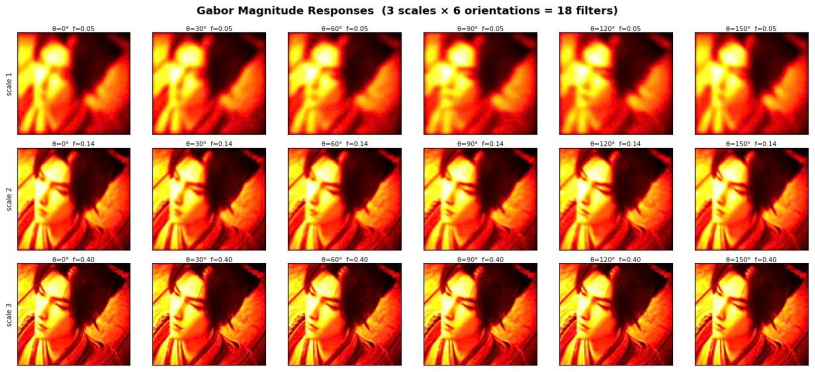
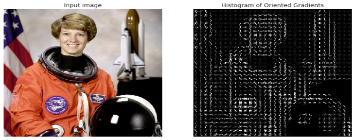
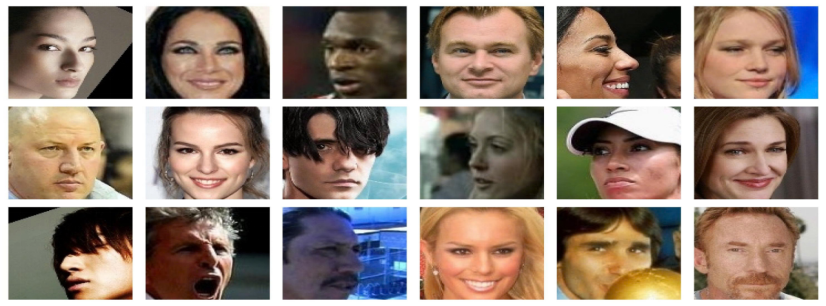
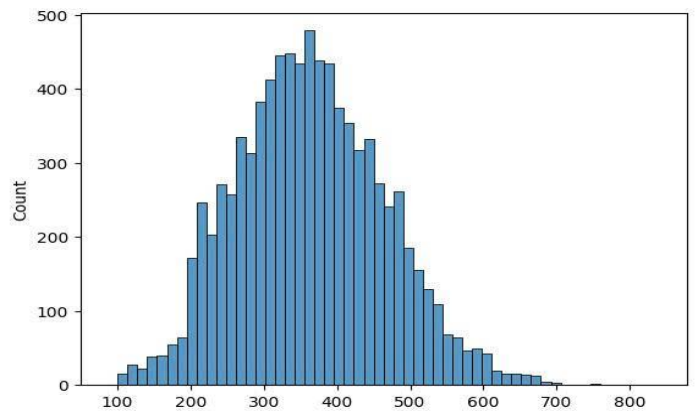
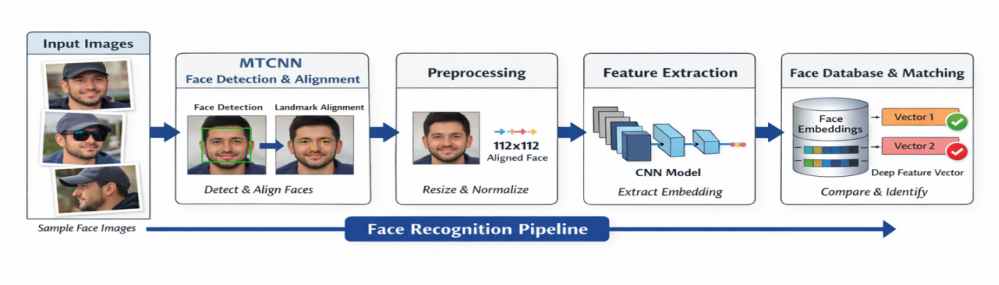
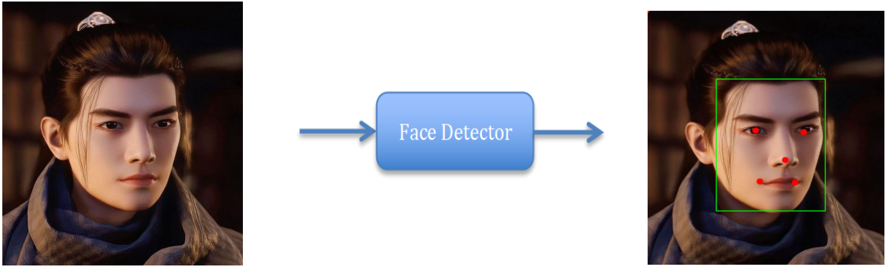
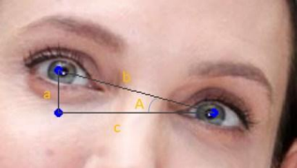
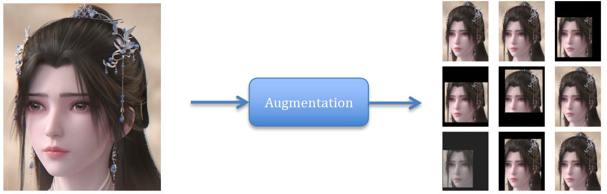
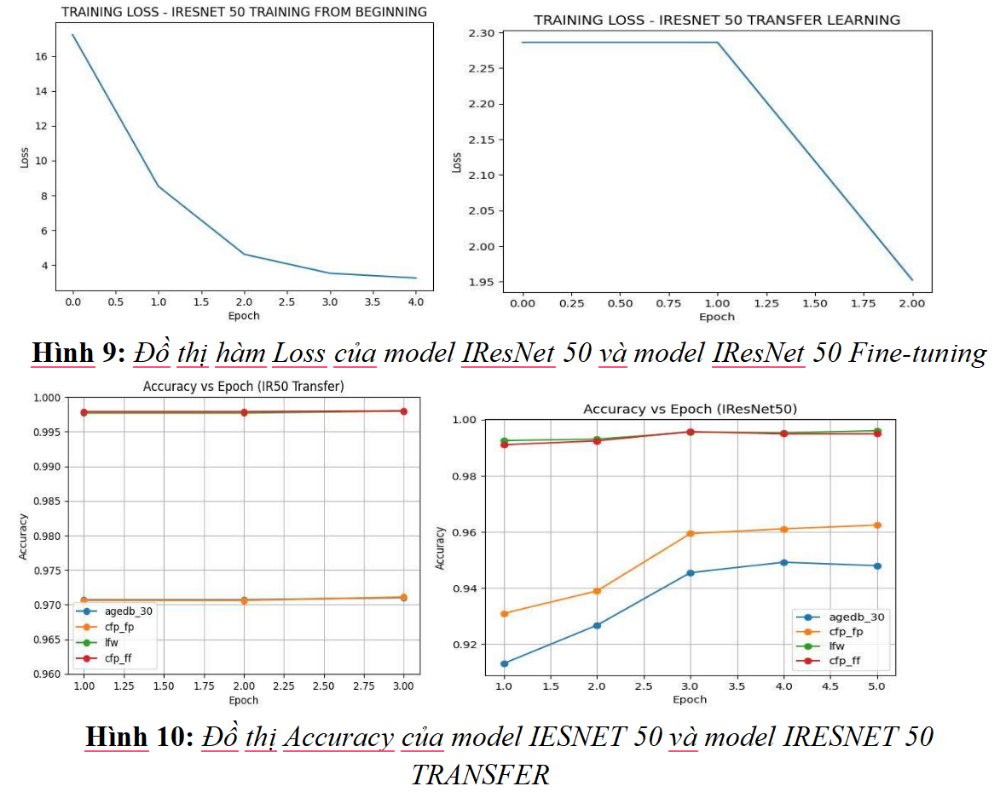
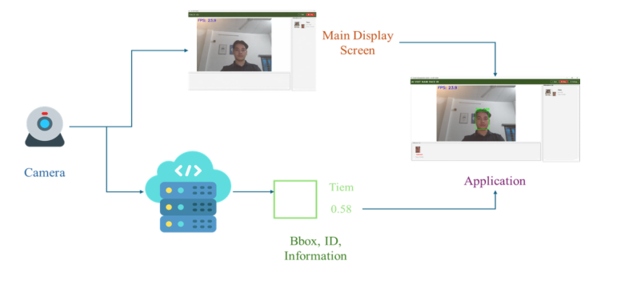

# FACIAL RECOGNITION SYSTEM  

**NGUYỄN NGỌC MINH, TRẦN THỊ HUYỀN, BÙI NHƯ Ý**  
*Khoa Công nghệ thông tin, Đại học Công nghiệp Thành phố Hồ Chí Minh*  
*Tác giả liên hệ: minhnguyen47431@gmail.com*  

**Tóm tắt:** Bài nghiên cứu đề xuất một pipeline nhận diện khuôn mặt dựa trên học sâu, kết hợp RetinaFace cho phát hiện và căn chỉnh khuôn mặt, mạng CNN (Convolutional Neural Networks) hoặc ViT (Vision Transformers) để trích xuất đặc trưng và hàm mất mát AdaFace nhằm học embedding thích nghi theo chất lượng ảnh. Mô hình được huấn luyện trên tập dữ liệu VGGFace 2 và đánh giá trên các bộ dữ liệu chuẩn như LFW, AGEDB_30, CFP và IJB-B/C. Kết quả thực nghiệm cho thấy phương pháp đạt hiệu năng ổn định trong cả các kịch bản đơn giản lẫn phức tạp. Hệ thống có tiềm năng ứng dụng thực tế trong các bài toán xác thực khuôn mặt trên camera, máy chấm công và các thiết bị thông minh, giúp xác thực nhanh chóng, giảm phụ thuộc vào các phương pháp truyền thống như mật khẩu hay vân tay, qua đó nâng cao hiệu suất làm việc.

**Từ khóa:** Nhận diện khuôn mặt, CNN, ViT, AdaFace, MTCNN, Face Embedding.

## 1. GIỚI THIỆU
Nhận diện khuôn mặt (Face Recognition) là một trong những bài toán quan trọng nhất của thị giác máy tính với tính ứng dụng cao như kiểm soát ra vào, chấm công và xác thực bảo mật. Tuy nhiên, việc triển khai trong thực tế vẫn đối mặt với nhiều thách thức lớn về sự biến đổi góc nhìn (pose), điều kiện ánh sáng (illumination) và biểu cảm khuôn mặt (expression). Các yếu tố này đòi hỏi mô hình không chỉ đạt độ chính xác cao mà còn phải tối ưu về tốc độ để đáp ứng yêu cầu xử lý thời gian thực.

Sự phát triển của học sâu (Deep Learning) đã tạo ra bước ngoặt với quy trình (pipeline) chuẩn hóa gồm bốn giai đoạn: phát hiện khuôn mặt (Face Detection), căn chỉnh (Alignment), trích xuất đặc trưng (Feature Extraction) và so khớp (Matching). Trong nghiên cứu này, chúng tôi tập trung xây dựng một hệ thống nhận diện hoàn chỉnh, ứng dụng các kiến trúc tiên tiến như RetinaFace và AdaFace. Hệ thống được thiết kế với giao diện tương tác trực tiếp, hỗ trợ đăng ký người dùng (enrollment) và nhận diện danh tính qua camera theo thời gian thực với độ trễ thấp.

## 2. CÁC NGHIÊN CỨU LIÊN QUAN

Nhận diện khuôn mặt hiện đại chủ yếu dựa trên mạng nơ-ron tích chập (CNN) kết hợp các kỹ thuật giảm chiều và phân loại. Một hướng tiếp cận tiêu biểu là hệ thống đa giai đoạn: trích xuất đặc trưng qua CNN, giảm chiều bằng PCA và phân loại bằng ensemble SVM. Chẳng hạn, Zhenyao et al. sử dụng CNN để biến đổi (warp) khuôn mặt về tư thế chính diện trước khi huấn luyện mạng phân loại danh tính.

Tuy nhiên, các phương pháp này tồn tại nhiều hạn chế:
* Kiến trúc phức tạp, không thể huấn luyện end-to-end.
* Việc tinh chỉnh thủ công các thành phần (CNN, PCA, SVM) gây tốn kém chi phí tính toán.
* Quá trình warp khuôn mặt dễ gây méo hình và suy giảm đặc trưng khi ảnh đầu vào bị nhiễu hoặc có độ phân giải thấp.
* Khó mở rộng cho các hệ thống quy mô lớn hoặc yêu cầu xử lý thời gian thực.

### 2.1. Các phương pháp dựa trên Deep Learning

#### 2.1.1. FaceNet: A Unified Embedding for Face Recognition and Clustering
FaceNet (2015) là phương pháp nhận dạng khuôn mặt dựa trên học sâu, sử dụng mạng CNN huấn luyện end-to-end để ánh xạ ảnh khuôn mặt thành các vector đặc trưng (embedding) trong không gian Euclidean. Mô hình sử dụng hàm mất mát Triplet Loss để trực tiếp tối ưu hóa khoảng cách: kéo gần các cặp cùng danh tính (anchor - positive) và đẩy xa các cặp khác danh tính (anchor - negative) theo một biên xác định. Nhờ cơ chế này, việc xác thực có thể thực hiện đơn giản bằng cách so sánh khoảng cách giữa các embedding mà không cần bộ phân loại phức tạp.

FaceNet chọn triplet gồm các cặp positive, negative và anchor và sau đó tối ưu hàm mất mát theo công thức sau:

$$\|f(x_i^a) - f(x_i^p)\|_2^2 + \alpha < \|f(x_i^a) - f(x_i^n)\|_2^2$$

Trong đó:
* $f(x) \in \mathbb{R}^d$
* $x$ là ảnh đầu vào  
 
Tuy nhiên, số lượng triplet là rất lớn khi dữ liệu lớn, cụ thể số triplet tăng theo $O(N^3)$. Ngoài ra việc chọn easy triplet khiến cho $loss=0$ hậu quả mô hình không học gì. Ngược lại việc chọn hard triplet làm cho mô hình dễ nhiễu, gradient không ổn định. Việc thiết kế Online / offline mining hay Semi-hard triplet đòi hỏi phải bỏ công sức training khó, dễ fail nếu mining không tốt.

#### 2.1.2. ArcFace: Additive Angular Margin Loss for Deep Face Recognition
ArcFace là một phương pháp học đặc trưng cho nhận dạng khuôn mặt được đề xuất năm 2019 (Deng et al.), nổi bật với hàm mất mát Additive Angular Margin Loss nhằm tăng cường khả năng phân biệt giữa các danh tính.

Về ý tưởng cốt lõi, ArcFace chuẩn hóa vector đặc trưng và trọng số lớp lên hypersphere, sau đó áp đặt một biên góc (angular margin) trực tiếp lên góc giữa embedding và trọng số lớp tương ứng. Điều này buộc các mẫu cùng danh tính phải gom chặt hơn theo góc, đồng thời đẩy các danh tính khác xa nhau hơn trên không gian góc. Công thức của ArcFace được triển khai như sau:

$$L = -\log \frac{e^{s \cos(\theta_{y_i} + m)}}{e^{s \cos(\theta_{y_i} + m)} + \sum_{j=1, j \neq y_i}^{N} e^{s \cos \theta_j}}$$

Tuy nhiên các bộ dữ liệu huấn luyện thường được thu thập từ internet, không thể tránh khỏi các ảnh có chất lượng thấp ảnh hưởng tới mô hình. Giải việc dữ liệu chất lượng thấp là điều các phương pháp trên vẫn chưa làm được.

### 2.2. Các phương pháp dựa trên đặc trưng truyền thống (Expert Methods)

#### 2.2.1. Gabor Filters trong Nhận diện khuôn mặt
Gabor Filters là một phương pháp mô phỏng hệ thị giác người để trích xuất đặc trưng kết cấu (texture) và cạnh. Bằng cách áp dụng đa hướng và đa tần số, Gabor Filters giúp làm nổi bật các thành phần quan trọng (mắt, mũi, đường viền) và duy trì tính ổn định trước biến đổi ánh sáng. Nghiên cứu này sử dụng bộ lọc với 3 frequency và 6 orientations, tạo ra 18 bản đồ phản hồi. Các kết quả này được làm phẳng và nối lại thành vector đặc trưng duy nhất có kích thước $\mathbb{R}^{225792}$ để phục vụ nhận diện.
  
Hình 1: Kết quả sau khi áp dụng họ các bộ lọc Gabor Filters với 3 frequency và 6 orientations

#### 2.2.2. Kernel PCA
Kernel PCA là một phương pháp giảm chiều dữ liệu mở rộng từ PCA truyền thống, cho phép xử lý các mối quan hệ phi tuyến. Thay vì biến đổi dữ liệu trực tiếp trong không gian ban đầu, Kernel PCA sử dụng "kernel trick" để ánh xạ dữ liệu vào một không gian đặc trưng có số chiều cao hơn. Sau khi áp dụng các bộ lọc Gabor lên ảnh, vector đặc trưng có kích thước rất lớn, chúng ta sẽ áp dụng Kernel PCA để nén số chiều gốc xuống còn 512 chiều.

#### 2.2.3. HOG (Histogram of Oriented Gradients)
HOG là một phương pháp trích xuất đặc trưng nhằm biểu diễn hình ảnh thông qua cấu trúc và hình dạng của các đối tượng bên trong. Ý tưởng cốt lõi của HOG là tập trung vào sự thay đổi của cường độ sáng, tức là các cạnh và đường viền trong ảnh thay vì giá trị màu sắc hay cường độ sáng đơn thuần.
  
Hình 2: Hình ảnh sau khi sử dụng HOG để trích xuất đặc trưng  

Trong bài nghiên cứu này, ngoài việc sử dụng các Foundation model để tạo sinh embeddings, chúng tôi còn kết hợp với các embeddings từ các expert (như Gabor Filters hay HOG) để so sánh kết quả.

## 3. PHƯƠNG PHÁP ĐỀ XUẤT

### 3.1. Dữ liệu
Dữ liệu sử dụng trong nghiên cứu là VGGFace 2, một tập dữ liệu lớn và phổ biến trong bài toán nhận diện khuôn mặt. Tập dữ liệu này đã được InsightFace tiền xử lý sẵn, bao gồm các bước quan trọng như phát hiện khuôn mặt, căn chỉnh (alignment) dựa trên landmark và resize ảnh về kích thước chuẩn $112 \times 112$. Việc tiền xử lý này giúp loại bỏ các nhiễu động về tư thế và tỉ lệ, tạo điều kiện tối ưu cho các hàm mất mát hiện đại như AdaFace trích xuất các đặc trưng định danh (embedding) chính xác, đảm bảo khả năng tái lập cao cho các thực nghiệm.
  
Hình 3: Bộ dữ liệu VGGFace 2

  
Hình 4: Biểu đồ Histogram về số lượng ảnh trong từng Identity (người) của bộ dữ liệu VGGFace 2  

Trong các nghiên cứu gần đây, người ta không đánh giá trên tập huấn luyện mà đánh giá trên một tập dữ liệu khác ví dụ SphereFace được huấn luyện trên các tập CASIA-WebFace và đánh giá Accuracy trên tập LFW và CFP-FP, còn việc đánh giá TAR@FAR được thực hiện trên các tập IJB-B và IJB-C. Để đồng nhất trong việc đánh giá, dự án này của chúng tôi cũng thực hiện theo khuôn mẫu các nghiên cứu trước đây làm. Trong đề này, ta sẽ thực hiện đánh giá Accuracy trên các tập dữ liệu AGEDB 30, LFW, CFP_FP, CFP_FF, và đánh giá các độ đo TAR@FAR trên các tập IJB-B và IJB-C.

Các tập LFW, AGEDB 30, CFP FP và CFP FF được thiết kế với giao thức verification 1:1 cân bằng, trong đó Accuracy phản ánh trực tiếp khả năng phân biệt giữa genuine và impostor pairs và cho phép so sánh công bằng với các phương pháp trước đây. Ngược lại, IJB-B và IJB-C mô phỏng các kịch bản thực tế phức tạp với nhiều ảnh/video trên mỗi danh tính, dữ liệu không kiểm soát và số lượng impostor pairs áp đảo, khiến Accuracy trở nên kém ý nghĩa. Do đó, TAR@FAR được sử dụng để đánh giá khả năng duy trì tỷ lệ chấp nhận đúng cao trong điều kiện FAR rất thấp, vốn là yêu cầu cốt lõi của các hệ thống nhận dạng khuôn mặt trong thực tế.

### 3.2. Tổng quan pipeline
  
Hình 5: Pipeline for Facial Recognition  

#### 3.2.1. Face Detection
Face Detection (phát hiện khuôn mặt) là giai đoạn tiền đề, trích xuất vùng chứa khuôn mặt (bounding box) và các điểm đặc trưng (landmarks) như mắt, mũi, miệng. Nghiên cứu này sử dụng RetinaFace, một mô hình học sâu hiện đại dựa trên cơ chế học đa nhiệm (multi-task learning). So với các kiến trúc như SCRFD hay YOLO, RetinaFace vượt trội ở khả năng xác định chính xác vị trí và các điểm mốc ngay cả trong điều kiện ánh sáng yếu hoặc góc nhìn phức tạp, đảm bảo độ chính xác cao và tốc độ xử lý thời gian thực cho hệ thống.
    

Sau khi căn chỉnh, ảnh khuôn mặt được crop và resize về kích thước $112 \times 112$, phù hợp với kiến trúc của Foundation Model sử dụng trong giai đoạn trích xuất đặc trưng. Tiếp theo, ảnh được chuẩn hóa giá trị pixel (ví dụ đưa về khoảng $[-1, 1]$ hoặc chuẩn hóa theo mean-std) nhằm tăng tốc độ hội tụ và cải thiện độ ổn định trong quá trình huấn luyện.

#### 3.2.2. Face Alignment
Trước khi đưa vào mô hình, ảnh được tiền xử lý nhằm đảm bảo tính đồng nhất và ổn định cho quá trình học. Cụ thể, khuôn mặt được căn chỉnh (Face Alignment) để chuẩn hóa vị trí và hướng nhìn, sau đó được thay đổi kích thước về một độ phân giải cố định phù hợp với kiến trúc mạng. Cuối cùng, giá trị pixel được chuẩn hóa nhằm tăng tốc độ hội tụ và cải thiện sự ổn định trong quá trình huấn luyện.

  
Hình 6: Thuật toán xoay ảnh dựa vào các điểm mốc neo của mắt trái và mắt phải  

Ảnh sau khi đi qua Retina-Face sẽ trả về các điểm mốc khuôn mặt, cùng với vị trí các bộ phận như mắt, miệng. Để thực hiện căn chỉnh khuôn mặt, ngoài việc sử dụng các mô hình Học sâu, chúng ta có thể dùng một thuật toán đơn giản để thực hiện căn chỉnh, cụ thể: Sau khi có được vị trí hai mắt, chúng ta có thể vẽ một tam giác vuông với độ dài cạnh lần lượt là a, b, c. Từ đó chúng ta có thể tính được góc $\cos(\theta) = \frac{c}{b}$. Sau đó, chúng ta chỉ cần xoay ảnh một gốc chúng ta sẽ thu được ảnh đã căn chỉnh.

#### 3.2.3. Tăng cường dữ liệu
Cụ thể, ảnh đầu vào có thể được cắt ngẫu nhiên kết hợp đệm (random resized crop với zero padding), giúp mô hình quen với các trường hợp khuôn mặt không nằm hoàn toàn ở trung tâm hoặc bị che khuất một phần. Bên cạnh đó, tăng cường độ phân giải thấp (low-resolution augmentation) được áp dụng bằng cách thu nhỏ ảnh xuống kích thước ngẫu nhiên rồi phóng to trở lại với các phương pháp nội suy khác nhau, nhằm mô phỏng ảnh mờ hoặc ảnh có chất lượng kém. Cuối cùng, tăng cường quang học (photometric augmentation) như thay đổi độ sáng, độ tương phản và độ bão hòa màu được sử dụng để giảm sự phụ thuộc của mô hình vào điều kiện ánh sáng và màu sắc. Các phép biến đổi này được áp dụng ngẫu nhiên theo xác suất xác định trước, giúp tăng tính đa dạng của dữ liệu huấn luyện mà không làm thay đổi danh tính khuôn mặt.
  
 
#### 3.2.4. Mạng CNN (Convolutional Neural Network)
Ảnh sau tiền xử lý được đưa vào mạng nơ-ron nhân tạo, đóng vai trò là backbone để trích xuất đặc trưng. Mô hình học các đặc trưng phân cấp từ mức thấp đến cao, bao gồm các đường biên, cấu trúc cục bộ của khuôn mặt và hình dạng tổng thể, sau đó ánh xạ ảnh đầu vào sang một không gian đặc trưng có chiều thấp hơn.

Đầu ra của mạng CNN là vector embedding kích thước $\mathbb{R}^{512}$, biểu diễn danh tính trong không gian đặc trưng sao cho các ảnh cùng người nằm gần nhau và khác người nằm xa nhau. Để so sánh, hệ thống sử dụng độ đo cosine similarity nhằm đánh giá sự tương đồng về hướng giữa các vector, giúp ổn định hóa quá trình nhận diện. Nếu giá trị này vượt qua ngưỡng (threshold) xác định, hai ảnh được xem là thuộc cùng một danh tính (same person); ngược lại, chúng được xem là hai người khác nhau (different person).

### 3.3. Phương pháp toán học đằng sau AdaFace
Hàm softmax được sử dụng để huấn luyện mô hình phân loại có dạng:

$$L(x_i) = -\log \frac{\exp(W_{y_i}^T x_i + b_{y_i})}{\sum_{j=1}^c \exp(W_j^T x_j + b_j)}$$

Trong đó:
* $x_i \in \mathbb{R}^d$ là vector embedding của mẫu thứ $i$
* $W_j \in \mathbb{R}^d$ là vector trọng số tương ứng với lớp thứ $j$
* $b_j$ là hệ số bias của lớp thứ $j$
* $y_i$ là nhãn đúng của mẫu
* $c$ là tổng số lớp

Hàm mất mát này khuyến khích embedding của mẫu $x$ có độ tương đồng cao với trọng số của lớp đúng và thấp với các lớp còn lại.

Ta nhận thấy tích vô hướng giữa hai vector có thể biểu diễn dưới dạng: $W_i^T x_i = \|W_i\| \cdot \|x_i\| \cos(\theta_i)$. Khi áp dụng chuẩn hóa L2 cho cả vector trọng số $W_i$ và vector embedding $x_i$ với $(\|W_i\| = \|x_i\| = 1)$, tích vô hướng khi đó chỉ còn phụ thuộc vào góc giữa hai vector: $W_i^T x_i = \cos(\theta_i)$. Để tăng khả năng phân tách giữa các lớp trong không gian embedding, một hệ số tỉ lệ $s$ được đưa vào nhằm mở rộng bán kính khối cầu lên lần.

Các nhà nghiên cứu trong bài báo AdaFace chỉ ra rằng chất lượng hình ảnh có ảnh hưởng trực tiếp đến vector embedding $x_i$. Do đó, hàm loss cần được thiết kế sao cho mô hình học mạnh hơn đối với các mẫu có chất lượng cao, đồng thời giảm mức độ ảnh hưởng của các mẫu có chất lượng trung bình hoặc thấp.

Sau khi đi qua mạng nơ-ron tích chập, vector embedding $x_j$ có độ lớn phụ thuộc vào số lượng unit đầu ra của mạng, dẫn đến sự không ổn định trong quá trình huấn luyện. Để khắc phục vấn đề này, AdaFace giới thiệu hai tham số thống kê $\mu_z$ và $\sigma_z$, lần lượt là kỳ vọng và độ lệch chuẩn của chuẩn L2 của embedding. Giá trị $\hat{z}_i$ phản ánh chất lượng tương đối của mẫu và được sử dụng để điều chỉnh quá trình học trong hàm loss. Việc giới hạn giá trị trong khoảng $[-1, 1]$ giúp loại bỏ các giá trị ngoại lai. Một tham số điều chỉnh $h$ được đưa vào nhằm nén thêm các giá trị còn lại về miền $[-1, 1]$. Quá trình chuẩn hóa này đóng vai trò quan trọng trong việc ổn định quá trình huấn luyện, tránh hiện tượng gradient bùng nổ.

Để khắc phục vấn đề khi kích thước batch nhỏ, AdaFace sử dụng kỹ thuật Exponential Moving Average (EMA) nhằm làm mượt và ổn định các tham số thống kê. Cụ thể, giá trị trung bình mu_z được cập nhật theo công thức: $mu_z = \alpha * mu_z^{k} + (1 - alpha) * mu_z^{k-1}$.

Dựa trên chất lượng ảnh được ước lượng thông qua $ẑ^i$, AdaFace điều chỉnh mức độ học của mô hình theo từng mẫu. Hàm logit được điều chỉnh như sau:

Để khắc phục vấn đề khi kích thước batch nhỏ, AdaFace sử dụng kỹ thuật Exponential Moving Average (EMA) nhằm làm mượt và ổn định các tham số thống kê. Cụ thể, giá trị trung bình mu_z được cập nhật theo công thức: $mu_z = alpha \cdot mu_z^{k} + (1 - alpha) \cdot mu_z^{k-1}$.

Dựa trên chất lượng ảnh được ước lượng thông qua $\hat{z}_i$, AdaFace điều chỉnh mức độ học của mô hình theo từng mẫu. Hàm logit được điều chỉnh như sau:

$$L(x_i) = -\log \frac{\exp(f(\theta_{y_i}, \hat{z}_i))}{\exp(f(\theta_{y_i}, \hat{z}_i)) + \sum_{j \neq y_i}^c \exp(s \cos \dot \theta_j)}$$

$$f(\theta_{y_i}, \hat{z}_i) = s \cdot (\cos(\theta_{y_i} + g_{angle}) - g_{add})$$

Trong đó:
* $g_{angle} = -m \cdot \hat{z}_i$
* $g_{add} = m \cdot \hat{z}_i + m$

Các thành phần này đóng vai trò margin thích nghi theo chất lượng mẫu.

Ngoài ra, nếu dữ liệu đa dạng pose, có thể áp dụng kỹ thuật sub-centers. Với mỗi danh tính, thiết lập $K$ sub-centers $W \in \mathbb{R}^{d \times N \times K}$. Khi đó $\theta_j = \arccos(\max_k(W_{jk}^T x_i))$ với $k = \{1, \dots, K\}$.

## 4. THỰC NGHIỆM VÀ KẾT QUẢ

### 4.1. Thông số huấn luyện
Trong nghiên cứu này, chúng tôi thực hiện huấn luyện mô hình với các thiết lập sau:
* **Hàm mất mát:** AdaFace.
* **Kiến trúc mạng (Backbones):** Thử nghiệm trên IResNet-18, IResNet-50 và Vision Transformer (ViT).
* **Optimizer:** Sử dụng SGD với momentum 0.9 và weight decay 5e-4.
* **Learning rate:** Bắt đầu từ 0.1, áp dụng chiến lược giảm dần (step scheduler) tại các epoch xác định để đảm bảo mô hình hội tụ tốt.
* **Dữ liệu:** Huấn luyện trên tập MS1MV2 (một bản tinh chỉnh của MS-Celeb-1M) để đạt được độ tổng quát hóa cao.

  

### 4.2. Kết quả trên các bộ dữ liệu chuẩn (Accuracy)
Chúng tôi tiến hành đánh giá độ chính xác (Accuracy %) trên các tập dữ liệu kiểm thử phổ biến. Kết quả cho thấy sự vượt trội của các kiến trúc lớn và hiệu quả của hàm loss AdaFace:

| Method | AGE DB | LFW | CFP-FP | CFP-FF |
| :--- | :---: | :---: | :---: | :---: |
| SphereFace | 97.05 | 99.67 | 96.84 | – |
| CosFace | 98.17 | 99.87 | 98.26 | – |
| MagFace | 98.17 | 99.83 | 98.46 | – |
| IResNet 18 | 99.48 | 99.55 | 95.10 | 99.46 |
| IResNet 50 | 94.80 | 99.60 | 96.24 | 99.49 |
| IResNet 50 fine-tuning | 97.1 | 99.80 | 97.11 | 99.80 |
| ViT fine-tuning | 96.57 | 99.83 | 97.46 | 99.85 |
| IResNet 18 + Gabor | 94.13 | 99.5 | 94.86 | 99.55 |
| ViT + Gabor | 96.25 | 99.85 | 97.36 | 99.82 |
| IResNet 50 + Gabor | 96.70 | 99.70 | 96.83 | 99.80 |
| IResNet 18 + HOG | 64.03 | 82.52 | 50.00 | 49.05 |
| IResNet 50 + HOG | 65.10 | 82.75 | 50.00 | 49.00 |
| ViT + HOG | 64.97 | 82.73 | 50.00 | 49.05 |

**Nhận xét:** * Trên tập LFW (điều kiện lý tưởng), hầu hết các mô hình đều đạt ngưỡng xấp xỉ 100%.
* Trên tập CFP-FP (biến đổi góc nhìn nghiêng) và AGE DB (biến đổi theo độ tuổi), mô hình ViT fine-tuningning** | **96.57** | **99.83** | **97.46** | **99.85** |

### 4.3. Đánh giá trên IJB-B và IJB-C (TAR@FAR)
Đây là các bài thử nghiệm quan trọng để đánh giá độ tin cậy của hệ thống trong môi trường thực tế. Độ đo được sử dụng là TAR (True Acceptance Rate) tại các mức FAR (False Acceptance Rate) cực thấp.

| Method | IJB-B 1e-4 | IJB-B 1e-5 | IJB-C 1e-4 | IJB-C 1e-5 |
| :--- | :---: | :---: | :---: | :---: |
| SphereFace | 89.19 | 73.58 | 91.77 | 83.33 |
| CosFace | 94.01 | 89.25 | 95.56 | 92.68 |
| MagFace | 94.33 | 89.88 | 95.81 | 93.67 |
| IResNet 18 | 89.82 | 81.37 | 91.90 | 86.67 |
| IResNet 50 | 91.34 | 84.75 | 93.42 | 89.36 |
| IResNet 50 fine-tuning | 93.15 | 81.27 | 94.99 | 88.84 |
| ViT fine-tuning | 94.06 | 85.88 | 95.76 | 91.44 |
| IResNet 18 + Gabor | 89.07 | 79.72 | 91.14 | 85.34 |
| IResNet 50 + Gabor | 92.77 | 80.57 | 94.62 | 88.14 |
| ViT + Gabor | 93.36 | 84.92 | 95.31 | 90.53 |
| IResNet 18 + HOG | 0.64 | 0.16 | 0.56 | 0.19 |
| IResNet 50 + HOG | 0.68 | 0.16 | 0.58 | 0.21 |
| ViT + HOG | 0.68 | 0.16 | 0.58 | 0.21 |

Kết quả thực nghiệm khẳng định rằng việc sử dụng AdaFace giúp mô hình giữ được tỷ lệ chấp nhận đúng (TAR) rất cao ngay cả khi tỷ lệ chấp nhận sai (FAR) bị giới hạn ở mức rất thấp ($10^{-4}$ và $10^{-5}$). Điều này chứng minh khả năng phân biệt cực tốt của mô hình đối với các cặp ảnh khó và ảnh chất lượng thấp.

## 5. TRIỂN KHAI HỆ THỐNG

### 5.1. Tổng quan về luồng hoạt động
Hệ thống được thiết kế theo mô hình Client-Server gồm ba lớp chính: Giao diện người dùng (GUI), API Backend và Cơ sở dữ liệu vector (FAISS). Luồng dữ liệu được xử lý qua hai giai đoạn chính:

**Giai đoạn Đăng ký (Enrollment):** Với mỗi người dùng mới, hệ thống thu thập từ 3–10 ảnh trong các điều kiện biến đổi (góc nhìn, ánh sáng, biểu cảm). Ảnh trải qua pipeline tiền xử lý: phát hiện bằng RetinaFace, căn chỉnh dựa trên landmarks, crop/resize về 112×112 và chuẩn hóa pixel. Các vector embedding 512-chiều trích xuất từ AdaFace được tổng hợp (tính trung bình hoặc trung tâm cụm) để tạo ra một đại diện duy nhất cho danh tính đó và lưu trữ vào cơ sở dữ liệu.

**Giai đoạn Nhận diện (Inference):** Khung hình từ Camera được truyền tới Backend qua WebSocket để xử lý thời gian thực. Sau khi đi qua pipeline tiền xử lý và trích xuất đặc trưng tương tự giai đoạn đăng ký, vector embedding thu được sẽ được so khớp với cơ sở dữ liệu thông qua độ đo cosine similarity. Danh tính có độ tương đồng cao nhất và vượt qua ngưỡng (threshold) xác định sẽ được trả về GUI để hiển thị bounding box và thông tin người dùng; ngược lại, hệ thống sẽ phân loại là "người lạ" (unknown).

### 5.2. Xử lý camera
  

### 5.3. Luồng xử lý camera cho hệ thống
Nhằm tối ưu hóa hiệu năng thời gian thực, hệ thống phân tách quy trình xử lý thành hai nhánh độc lập. Nhánh hiển thị truyền trực tiếp luồng video từ camera tới GUI để đảm bảo tốc độ khung hình (FPS) ổn định và giảm độ trễ thị giác. Song song đó, nhánh nhận dạng gửi các khung hình tới máy chủ qua kết nối không đồng bộ để thực hiện chuỗi tác vụ: phát hiện khuôn mặt, trích xuất đặc trưng và so khớp danh tính. Kết quả phản hồi (bounding box, định danh, độ tương đồng) sau đó được chồng (overlay) lên luồng video gốc. Kiến trúc này giúp duy trì sự mượt mà của giao diện ngay cả khi quá trình suy luận mô hình gặp độ trễ, đảm bảo tính ổn định cho toàn hệ thống.

## REFERENCES

[1] ArcFace: Additive Angular Margin Loss for Deep Face Recognition  
[2] ArcFace: Một Bước Tiến Trong Nhận Diện Khuôn Mặt  
[3] Deep Face Detection with MTCNN in Python  
[4] What Does False Rejection Rate FRR Mean And Its Importance?  
[5] Operational Measures and Accuracies of ROC Curve on Large Fingerprint Data Sets  
[6] Progress Report on Implementation of Evaluation Metrics and Protocols (v1)  
[7] SphereFace: Deep Hypersphere Embedding for Face Recognition  
[8] CosFace: Large Margin Cosine Loss for Deep Face Recognition
